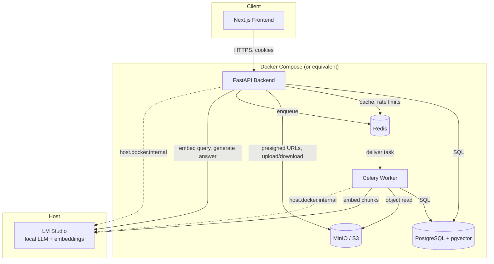
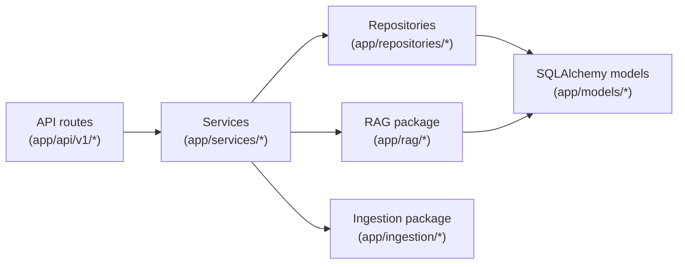

# Architecture

High-level system architecture as of Phase 5. This is the first pass at
this document - it covers what exists (Phases 1-5); it will keep growing as
later phases land, per the README's Phase 12 documentation plan.

## System overview

Retriva is a modular monolith, not a microservices system: one FastAPI
process serves the HTTP API, one Celery worker process handles background
work, and both share the same Python codebase and the same Postgres
database. This is a deliberate choice for a project at this scale - it
avoids the operational overhead of service-to-service auth, network
boundaries, and distributed tracing for a system that doesn't yet have the
load or team size to justify them. See [Scaling considerations](#scaling-considerations)
for what would change if that stopped being true.

## Request paths

Two fundamentally different request shapes exist in the system:

1. **Synchronous CRUD** (auth, organizations, members, document upload/list/
   download/delete, conversation listing): a route handler resolves
   dependencies (auth, org membership, RBAC), a service performs one
   transaction, a response returns - typically single-digit milliseconds
   plus network latency.
2. **Long-running work**: document ingestion (parsing/chunking/embedding, a
   background Celery task - see `docs/document-ingestion.md`) and RAG chat
   (retrieval + local LLM generation, synchronous within the request but
   can take tens of seconds against a local model - see `docs/rag.md`).
   Both are deliberately NOT one giant transaction; each commits
   incrementally so a slow step never holds a database connection open for
   its full duration (see each doc's discussion of this).

## Layering

- **Routes** are thin: parse/validate the request (Pydantic), resolve
  auth/org-context dependencies, call exactly one service method, shape the
  response. No business logic lives here.
- **Services** own orchestration and transactions. `DocumentService`,
  `RAGService`, `ConversationService`, `AuthService`, etc.
- **Repositories** own query construction and are the only place raw
  SQLAlchemy `select`/`insert`/`delete` statements for a given table are
  written, so tenant-scoping logic for that table exists in exactly one
  place.
- **RAG** (`app/rag/`) and **Ingestion** (`app/ingestion/`) are pipeline
  packages: pure-ish, mostly-async, no HTTP/FastAPI knowledge, which is
  what makes them independently testable (see each package's tests).

## Multi-tenancy

Every domain table that isn't itself an organization carries
`organization_id` (or reaches it through one hop - `document_chunks`
through `documents`, `messages` through `conversations`). There is no
Postgres row-level security; isolation is enforced entirely at the
application layer, consistently, via one pattern used everywhere:

- A route depends on `get_org_context` (or `require_role(...)`), which
  resolves the `organization_id` path parameter against the **caller's own
  membership row** - never trusts a bare ID.
- A resource lookup by ID always also filters by `organization_id` (or a
  join back to it). A resource that exists but belongs to another org is
  treated identically to one that doesn't exist - **404, never 403** - so
  organization existence is never leaked to an outsider probing IDs.

This pattern is documented per-subsystem: `docs/document-ingestion.md`
(chunks through documents), `docs/retrieval.md` (retrieval SQL joins),
`docs/rag.md` (conversations/messages).

## Provider abstraction

Three external-service boundaries are behind small Protocol interfaces,
each with a real implementation (LM Studio / MinIO) and a test
implementation, so the application layer never imports a concrete
provider class directly:

| Interface | Real implementation | Test implementation |
|---|---|---|
| `StorageProvider` | `S3StorageProvider` (MinIO/S3) | `InMemoryStorageProvider` |
| `EmbeddingProvider` | `LMStudioEmbeddingProvider` | `DeterministicTestEmbeddingProvider` |
| `LLMProvider` | `LMStudioLLMProvider` | `StubLLMProvider` |

All three are constructed via a plain factory function
(`get_storage_provider()`, `get_embedding_provider()`, `get_llm_provider()`)
injected through FastAPI `Depends()` in routes, and called directly (no DI
container) in Celery tasks and CLI scripts. See `docs/rag.md` for why the
LLM/embedding providers specifically need to avoid caching an HTTP client
across event loops.

## Zero-cost constraint

No component in this system requires a paid API key to function. Local
inference (LM Studio, OpenAI-compatible) is the only LLM/embedding path
that exists; reranking is fusion-only (Reciprocal Rank Fusion over vector +
keyword search - see `docs/retrieval.md`), not a paid reranking API.
Misconfiguration (LM Studio unreachable, wrong model) fails loudly with a
clear error - it never silently falls back to a cloud service.

## Scaling considerations

Not implemented, but worth naming plainly rather than pretending the
current design scales indefinitely:

- **Single Postgres instance** is both the OLTP store and the vector index.
  At meaningfully large corpora (millions of chunks) this would want either
  a tuned `ivfflat`/`hnsw` index (see `docs/retrieval.md`'s index-tuning
  note) or a dedicated vector store - not needed at this project's scale.
- **One Celery worker process** with default concurrency handles ingestion;
  a real multi-tenant SaaS would need per-organization fairness (a slow
  customer's huge PDF backlog shouldn't starve everyone else's uploads),
  which isn't implemented.
- **One LM Studio instance shared by all requests** is a hard concurrency
  ceiling - a single local model serves one generation at a time in
  practice. This is explicitly fine for a portfolio/dev project and
  explicitly not fine for production multi-tenant load; the `LLMProvider`
  abstraction is what would let a real deployment swap in a
  properly-scaled self-hosted inference server (vLLM, TGI) or a paid API
  behind the same interface, without touching `RAGService`.
- **Response streaming** (Phase 6, see `docs/streaming.md`) still shares
  the same single-LM-Studio-instance ceiling above - a stream just makes
  the wait latency-hidden (tokens render incrementally) rather than
  removing the underlying one-generation-at-a-time constraint.
