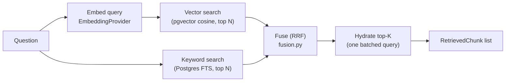

# Retrieval

Hybrid (vector + keyword) retrieval: architecture, the fusion formula, the
pgvector and PostgreSQL FTS schemas, tenant isolation, and known tuning
gaps. See `docs/rag.md` for what happens to retrieval results downstream
(context building, prompting, citation validation).

## Pipeline



`app/rag/retrieval/`:
- `vector.py` - `VectorRetriever`, pgvector cosine distance.
- `keyword.py` - `KeywordRetriever`, PostgreSQL full-text search.
- `fusion.py` - `reciprocal_rank_fusion`, a pure function (no DB access) -
  the only piece of this pipeline that's exhaustively unit-testable, and
  deliberately kept that way.
- `hybrid.py` - `HybridRetriever`, orchestrates the above and hydrates the
  final chunk_ids into full records in one query (never one query per
  chunk).

## Vector search

Uses the existing `document_chunks.embedding` `vector(768)` column and the
existing `ivfflat` index from the Phase 4 migration - this phase did not
change the embedding dimension or add a second vector index.

```sql
SELECT dc.id, 1 - (dc.embedding <=> :query_embedding) AS similarity
FROM document_chunks dc
JOIN documents d ON d.id = dc.document_id
WHERE d.organization_id = :org_id AND d.status = 'READY'
ORDER BY dc.embedding <=> :query_embedding
LIMIT :candidate_pool
```

`<=>` is pgvector's cosine **distance** operator (`0` = identical,
`2` = opposite); similarity is `1 - distance`. `1 - (a <=> b)` is
mathematically equivalent to pgvector's own `<#>`/cosine-similarity
convenience but written explicitly here so the returned `similarity` value
is unambiguous at every call site that reads it (the retrieval-debug
endpoint, the insufficient-evidence threshold check).

**`d.status = 'READY'` is not optional.** The ingestion pipeline
deletes-then-reinserts chunks on every (re)processing run (see
`docs/document-ingestion.md`) - a document mid-reprocessing can have a
partial or stale chunk set. Without this filter, a `PROCESSING` or `FAILED`
document's chunks could be retrieved and cited as if they were current.

### Index tuning: a known, documented gap

The `ivfflat` index (`ix_document_chunks_embedding_cosine`) was created in
the Phase 4 migration against an **empty table**. IVFFlat's clustering
(`lists = 100`) is trained from whatever data exists at index-creation
time - training it against zero rows means its centroids are meaningless
for the data actually stored later. In practice, at this project's current
corpus size, PostgreSQL's query planner will generally choose a sequential
scan over the (badly-trained) index anyway, which is *more* accurate, not
less - so this isn't silently producing wrong results today. It would
become a real problem at a large corpus size, where a seq scan stops being
the planner's obvious choice and the mis-trained index starts actually
getting used.

**Remedy, if/when the corpus grows large enough to matter:**
`REINDEX INDEX ix_document_chunks_embedding_cosine;` after a meaningful
amount of real data exists, so IVFFlat's centroids reflect actual vector
distribution - or migrate to an `hnsw` index (pgvector ≥0.5), which doesn't
have this "must be trained on real data" sensitivity in the same way.
Neither was done in this phase: doing it now, against an empty/near-empty
table, would not have fixed anything and would have been indistinguishable
from doing nothing.

## Keyword search

PostgreSQL native full-text search - no Elasticsearch/OpenSearch. A
generated, indexed `tsvector` column, not a query-time `to_tsvector()`
call:

```sql
ALTER TABLE document_chunks
  ADD COLUMN content_tsv tsvector
  GENERATED ALWAYS AS (to_tsvector('english', content)) STORED;
CREATE INDEX ix_document_chunks_content_tsv ON document_chunks USING gin (content_tsv);
```

Why a generated column and not `to_tsvector(content)` at query time: the
latter can't be served by a plain GIN index (it would need a functional
index instead) and would recompute the tsvector for every row on every
query. Why the explicit two-argument `to_tsvector('english', content)` and
not the one-argument form: `to_tsvector(text)` reads a session-configurable
default text-search configuration, which Postgres considers `STABLE`, not
`IMMUTABLE` - and a generated column's expression must be immutable. The
one-argument form is rejected outright ("generation expression is not
immutable"); the explicit-language form is what makes this legal.

Query side uses `websearch_to_tsquery`, not `plainto_tsquery` or a
hand-rolled `to_tsquery`:

```sql
SELECT dc.id, ts_rank(dc.content_tsv, websearch_to_tsquery('english', :query)) AS rank
FROM document_chunks dc
JOIN documents d ON d.id = dc.document_id
WHERE d.organization_id = :org_id AND d.status = 'READY'
  AND dc.content_tsv @@ websearch_to_tsquery('english', :query)
ORDER BY rank DESC
LIMIT :candidate_pool
```

`websearch_to_tsquery` accepts a query the way a person actually types one
into a chat box - quoted phrases, `-exclude`, bare `OR` - without raising a
syntax error on stray punctuation the way `to_tsquery` would. This is the
right choice specifically because the query text here is a live user
question, not a controlled/sanitized search string.

## Score fusion: Reciprocal Rank Fusion (RRF)

**The formula:**

```
fused_score(chunk) = vector_weight / (k + vector_rank)   [if the chunk appears in vector results]
                    + keyword_weight / (k + keyword_rank)  [if the chunk appears in keyword results]
```

where `vector_rank`/`keyword_rank` are 1-indexed positions within each
retriever's own result list (rank 1 = best), and `k` (`RRF_K`, default 60)
is the damping constant from the original RRF paper (Cormack, Clarke &
Buettcher, 2009). `VECTOR_SEARCH_WEIGHT` (default 0.7) and
`KEYWORD_SEARCH_WEIGHT` (default 0.3) are configurable, per the spec's
example.

**Why RRF and not "normalize both scores to [0,1], then weighted sum":**
this was the first design considered and rejected. pgvector cosine
similarity for real embedding models is *usually* roughly `[0, 1]`, but
`ts_rank` is an unbounded, corpus- and query-dependent value with no fixed
ceiling - a two-word exact match can outscore a five-word partial match
depending on term-frequency weighting, and there is no principled constant
to divide by. Min-max normalizing *within each candidate set* looks
appealing but is mathematically deceptive: it forces the single best hit
of *every* query to score exactly `1.0`, regardless of whether that hit is
actually any good - a query with no relevant documents at all would still
produce a fused top score of `1.0`, right alongside a query with a perfect
match. That would make any downstream confidence threshold on the fused
score meaningless. RRF sidesteps this by fusing **rank position**, never
raw value - the two retrievers' incompatible scales never have to meet.

**Consequence for the confidence threshold:** because fused RRF scores
aren't on a meaningful absolute scale, `RETRIEVAL_MIN_SIMILARITY` (default
`0.3`) is checked against the **raw vector cosine similarity of the single
best vector hit**, never against a fused score. This was verified against
this project's actual data: `SELECT embedding <=> embedding FROM
document_chunks LIMIT 1` returns `0` (self-distance), confirming
`similarity = 1 - distance` behaves as expected on this schema before the
threshold was chosen.

### Limitations of the confidence threshold (stated plainly)

`RETRIEVAL_MIN_SIMILARITY = 0.3` is a heuristic, not a calibrated
probability of relevance. It was chosen as a reasonable-sounding cutoff,
not derived from labeled relevance data (none exists yet - see
`docs/document-ingestion.md`'s evaluation-foundation note and
`app/evaluation/retrieval.py`). Its behavior also depends entirely on the
embedding model in use: different models produce different similarity
distributions for "actually relevant" vs. "unrelated" text, so a threshold
tuned for one `EMBEDDING_MODEL` is not guaranteed to transfer to another
without re-checking. It is deliberately conservative in one specific,
tested way: `DeterministicTestEmbeddingProvider` (hash-based, no semantic
meaning - see its docstring) produces near-zero similarity for any two
different strings, which reliably trips this threshold in tests that don't
use the exact chunk content as the query - this is expected and correct
behavior for that fake, not a bug in the threshold.

## Two-stage candidate retrieval

Stage 1 (`RETRIEVAL_CANDIDATE_POOL`, default 30): each retriever
independently fetches its own top-N candidates. Stage 2: `fuse()` combines
both lists, and only the final `RETRIEVAL_TOP_K` (default 8) survive into
`HybridRetriever`'s single hydration query. This bounds the work in both
directions - neither retriever ever needs to consider the entire corpus,
and the DB is never asked to fetch full row data for more chunks than could
possibly end up in the final context.

## Deduplication

A chunk that scores highly in *both* vector and keyword search appears
exactly once in `fuse()`'s output (see `fusion.py`'s dict-keyed-by-
`chunk_id` construction) - its two per-retriever ranks are combined into
one `fused_score`, never double-counted as two separate result rows. Chunk
identity for this purpose is always `chunk_id` (a UUID primary key), never
content equality.

## Metadata filtering

At minimum, and non-optionally: every query filters on `organization_id`
(joined through `documents`) and `status = 'READY'`. There is no API
surface for a client to supply arbitrary SQL filters - `HybridRetriever`
takes exactly `organization_id`, `query`, `candidate_pool`, and `top_k` as
parameters. Filtering by `document_id`, document type, section, or page is
architecturally straightforward to add later (an additional `WHERE`
clause in both retrievers) but isn't exposed yet, since nothing in Phase 5
needs it.

## Tenant isolation (the one rule that must never break)

Every retrieval query in this package joins `document_chunks` to
`documents` and filters on `documents.organization_id` - there is no query
in `vector.py` or `keyword.py` that reads `document_chunks` without that
join. `HybridRetriever._hydrate` re-applies the same `organization_id`
filter a second time when fetching full chunk records for the final
top-K, as defense in depth: even if a chunk_id were ever produced by a
future code path without going through the org-scoped candidate queries,
hydration alone would still refuse to return it for the wrong org.
Verified with integration tests covering: another org's identical-content
chunk is never returned; a chunk belonging to a `PROCESSING`/`FAILED`
document is never returned; a debug-retrieval request against another
org's data returns nothing (see `tests/integration/test_retrieval.py`).

## Retrieval debug endpoint

`POST /organizations/{id}/retrieval/debug` (ADMIN-only) runs the same
`HybridRetriever` and returns per-chunk vector score, keyword score, fused
score, and final rank - useful for diagnosing "why didn't it find X" during
development and for the evaluation foundation
(`app/evaluation/retrieval.py`). Never reachable below ADMIN, and never
wired into the normal chat response path.

## Performance

- No N+1 queries: candidate retrieval is two queries total (one per
  retriever) regardless of `candidate_pool` size, and hydration is one
  additional query regardless of `top_k` size.
- `RETRIEVAL_CANDIDATE_POOL` and `RETRIEVAL_TOP_K` both bound the amount of
  data ever pulled from Postgres or sent to the embedding/LLM providers per
  request - nothing in this pipeline scans or returns an unbounded result
  set.
