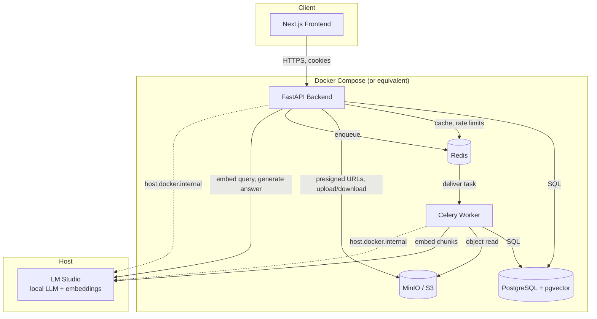
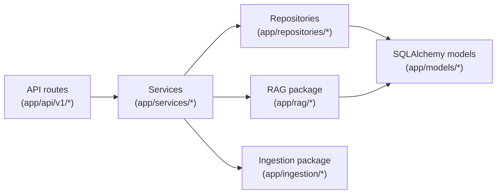

# Architecture

High-level system architecture as of Phase 5. This is the first pass at
this document - it covers what exists (Phases 1-5); it will keep growing as
later phases land, per the README's Phase 12 documentation plan.

## System overview

Retriva is a modular monolith, not a microservices system: one FastAPI
process serves the HTTP API, one Celery worker process handles background
work, and both share the same Python codebase and the same Postgres
database. This is a deliberate choice for a project at this scale - it
avoids the operational overhead of service-to-service auth, network
boundaries, and distributed tracing for a system that doesn't yet have the
load or team size to justify them. See [Scaling considerations](#scaling-considerations)
for what would change if that stopped being true.

## Request paths

Two fundamentally different request shapes exist in the system:

1. **Synchronous CRUD** (auth, organizations, members, document upload/list/
   download/delete, conversation listing): a route handler resolves
   dependencies (auth, org membership, RBAC), a service performs one
   transaction, a response returns - typically single-digit milliseconds
   plus network latency.
2. **Long-running work**: document ingestion (parsing/chunking/embedding, a
   background Celery task - see `docs/document-ingestion.md`) and RAG chat
   (retrieval + local LLM generation, synchronous within the request but
   can take tens of seconds against a local model - see `docs/rag.md`).
   Both are deliberately NOT one giant transaction; each commits
   incrementally so a slow step never holds a database connection open for
   its full duration (see each doc's discussion of this).

## Layering

- **Routes** are thin: parse/validate the request (Pydantic), resolve
  auth/org-context dependencies, call exactly one service method, shape the
  response. No business logic lives here.
- **Services** own orchestration and transactions. `DocumentService`,
  `RAGService`, `ConversationService`, `AuthService`, etc.
- **Repositories** own query construction and are the only place raw
  SQLAlchemy `select`/`insert`/`delete` statements for a given table are
  written, so tenant-scoping logic for that table exists in exactly one
  place.
- **RAG** (`app/rag/`) and **Ingestion** (`app/ingestion/`) are pipeline
  packages: pure-ish, mostly-async, no HTTP/FastAPI knowledge, which is
  what makes them independently testable (see each package's tests).

## Multi-tenancy

Every domain table that isn't itself an organization carries
`organization_id` (or reaches it through one hop - `document_chunks`
through `documents`, `messages` through `conversations`). There is no
Postgres row-level security; isolation is enforced entirely at the
application layer, consistently, via one pattern used everywhere:

- A route depends on `get_org_context` (or `require_role(...)`), which
  resolves the `organization_id` path parameter against the **caller's own
  membership row** - never trusts a bare ID.
- A resource lookup by ID always also filters by `organization_id` (or a
  join back to it). A resource that exists but belongs to another org is
  treated identically to one that doesn't exist - **404, never 403** - so
  organization existence is never leaked to an outsider probing IDs.

This pattern is documented per-subsystem: `docs/document-ingestion.md`
(chunks through documents), `docs/retrieval.md` (retrieval SQL joins),
`docs/rag.md` (conversations/messages).

## Provider abstraction

Three external-service boundaries are behind small Protocol interfaces,
each with a real implementation (LM Studio / MinIO) and a test
implementation, so the application layer never imports a concrete
provider class directly:

| Interface | Real implementation | Test implementation |
|---|---|---|
| `StorageProvider` | `S3StorageProvider` (MinIO/S3) | `InMemoryStorageProvider` |
| `EmbeddingProvider` | `LMStudioEmbeddingProvider` | `DeterministicTestEmbeddingProvider` |
| `LLMProvider` | `LMStudioLLMProvider` | `StubLLMProvider` |

All three are constructed via a plain factory function
(`get_storage_provider()`, `get_embedding_provider()`, `get_llm_provider()`)
injected through FastAPI `Depends()` in routes, and called directly (no DI
container) in Celery tasks and CLI scripts. See `docs/rag.md` for why the
LLM/embedding providers specifically need to avoid caching an HTTP client
across event loops.

## Zero-cost constraint

No component in this system requires a paid API key to function. Local
inference (LM Studio, OpenAI-compatible) is the only LLM/embedding path
that exists; reranking is fusion-only (Reciprocal Rank Fusion over vector +
keyword search - see `docs/retrieval.md`), not a paid reranking API.
Misconfiguration (LM Studio unreachable, wrong model) fails loudly with a
clear error - it never silently falls back to a cloud service.

## Scaling considerations

Not implemented, but worth naming plainly rather than pretending the
current design scales indefinitely:

- **Single Postgres instance** is both the OLTP store and the vector index.
  At meaningfully large corpora (millions of chunks) this would want either
  a tuned `ivfflat`/`hnsw` index (see `docs/retrieval.md`'s index-tuning
  note) or a dedicated vector store - not needed at this project's scale.
- **One Celery worker process** with default concurrency handles ingestion;
  a real multi-tenant SaaS would need per-organization fairness (a slow
  customer's huge PDF backlog shouldn't starve everyone else's uploads),
  which isn't implemented.
- **One LM Studio instance shared by all requests** is a hard concurrency
  ceiling - a single local model serves one generation at a time in
  practice. This is explicitly fine for a portfolio/dev project and
  explicitly not fine for production multi-tenant load; the `LLMProvider`
  abstraction is what would let a real deployment swap in a
  properly-scaled self-hosted inference server (vLLM, TGI) or a paid API
  behind the same interface, without touching `RAGService`.
- **Response streaming** (Phase 6, see `docs/streaming.md`) still shares
  the same single-LM-Studio-instance ceiling above - a stream just makes
  the wait latency-hidden (tokens render incrementally) rather than
  removing the underlying one-generation-at-a-time constraint.

## High-availability architecture proposal (design only - not implemented)

Written as part of the post-completion hardening cycle's Performance +
Stability workstream, at the user's explicit request for **a design
proposal only** - no AWS resources were provisioned or changed to
produce this. The live deployment remains exactly what
`docs/aws-deployment.md` describes: one `t3.small` EC2 instance running
the full Docker Compose stack, no load balancer, no managed data
services. That is a deliberate, cost-conscious choice for a
single-instance portfolio deployment, not an oversight - the table
below is "what would change and why if this needed to survive real
production traffic and single-node failure," not a recommendation to
build it now.

| Component today | Single point of failure it creates | What a production HA version would need | Why | Rough added cost |
|---|---|---|---|---|
| One EC2 instance runs backend, worker, frontend, nginx, Postgres, Redis, MinIO in Docker Compose | The entire stack goes down together - an OS-level crash, an OOM (already observed live, see "Compute configuration"), or a bad `docker compose up` takes out the app, the database, and the queue in one event | Split app instances from stateful services; run >=2 app instances (backend+frontend) behind a load balancer, in >=2 Availability Zones | An instance failure currently means full downtime with no automatic failover; splitting compute from state is the prerequisite for everything else in this table | ALB: ~$18-25/mo + a second `t3.small`: ~$18-22/mo |
| nginx on the same instance is the only reverse proxy/TLS terminator | nginx dying takes down all routing, including health checks | An AWS Application Load Balancer (or a managed nginx/Traefik pair) terminating TLS, health-checking each app instance, and routing only to healthy ones | Removes nginx-on-a-single-box as a SPOF; ACM-issued certificates also remove this project's current Let's-Encrypt-on-webroot renewal machinery as an operational dependency | Included in ALB cost above; ACM certs are free |
| Postgres + pgvector runs as a container on the same instance, backed by that instance's EBS volume | Instance loss risks data loss beyond the last backup (`docs/aws-deployment.md`'s backup workstream mitigates this partially, but recovery is manual and has RPO/RTO measured in the backup interval, not seconds) | Amazon RDS for PostgreSQL (with the pgvector extension, supported on RDS Postgres 15+) in Multi-AZ mode | Automated failover, continuous backup/point-in-time-recovery, and no more manual `pg_dump`/restore runbook | RDS `db.t3.small` Multi-AZ: roughly **$50-70/mo** - the single largest line item in this table |
| Redis (Celery broker + result backend, rate-limit counters) runs as a container on the same instance | Losing it drops in-flight Celery task state and momentarily breaks rate limiting (fails open/closed depending on the code path - worth re-checking if this is ever built) | Amazon ElastiCache for Redis, single replica minimum | Removes Redis from the same blast radius as the app; Celery broker loss currently means retried/lost in-flight jobs with no durability guarantee beyond Redis's own container | ElastiCache `cache.t3.micro` + replica: roughly **$25-35/mo** |
| MinIO runs as a container on the same instance, backed by that instance's EBS volume | Instance loss risks document/original-file loss; no cross-AZ redundancy | Amazon S3 (this project's `StorageProvider` abstraction already supports an S3 backend option architecturally, not just MinIO - see `docs/architecture.md`'s "Provider abstraction" section) | S3 gives 11-nines durability and multi-AZ redundancy by default, at a smaller operational footprint than self-managing MinIO's own replication | S3 standard storage: pennies at this project's data volume; no fixed monthly floor |
| One Celery worker process, no autoscaling | Ingestion throughput has a hard ceiling (see Concurrency/soak results in `docs/performance.md`); a worker crash pauses all ingestion until the container restarts | >=2 worker instances/tasks, ideally autoscaled on queue depth (Celery + CloudWatch custom metric, or a managed queue-depth-based scaling policy) | Removes ingestion as a single-worker bottleneck and SPOF; directly addresses the "one Celery worker" limitation already named above | A second worker instance: ~$18-22/mo, or shared with the second app instance |
| No container registry; the frontend image is built on GitHub Actions and shipped over SSH (`docker save \| gzip`) | Works today at this project's deploy frequency, but doesn't scale to >2 app instances needing the same image, and has no image version history beyond the running container | Amazon ECR (or another registry) as the source of truth each app instance pulls from on deploy | Multi-instance deploys need a shared pull target, not point-to-point SSH shipping; also enables faster rollback (pull a previous tag) than the current SSH-replace flow | ECR: a few dollars/mo at this project's image size/retention |
| Observability (structlog, Prometheus, OpenTelemetry/Jaeger - see `docs/observability.md`) runs per-instance, not centralized | Multiple app instances would produce fragmented logs/metrics/traces with no single place to see cross-instance behavior; today's single instance sidesteps this by construction | Centralize metrics (Amazon Managed Prometheus or CloudWatch), logs (CloudWatch Logs or an aggregator), and traces (AWS X-Ray or a managed Jaeger/Tempo) so behavior across instances is visible in one place | Required as soon as there is more than one app instance producing telemetry - not needed before that point | CloudWatch Logs/Metrics: usage-based, roughly **$5-15/mo** at low volume; Managed Prometheus adds more |
| No autoscaling; instance count is fixed at one | Traffic spikes degrade latency (see concurrency results in `docs/performance.md`) rather than triggering more capacity | An Auto Scaling Group for the app tier, scaling on CPU or request-latency CloudWatch alarms | Lets capacity track load instead of being fixed; only meaningful once there are >=2 instances behind a load balancer already | Cost scales with actual usage, not a fixed floor - hard to estimate without real traffic data |
| Backups exist (`docs/aws-deployment.md`'s backup workstream) but recovery is a manual, single-instance runbook | No tested disaster-recovery plan for "the whole AWS account/region becomes unavailable," only "this instance's disk is corrupted" | A documented, periodically-*tested* DR runbook, plus (if ever justified by real availability requirements) cross-region backup replication | The gap between "backups exist" and "disaster recovery is proven to work" is real and worth naming, even though nothing here suggests today's traffic level justifies closing it yet | Cross-region S3 replication: pennies at this volume; the real cost is testing time, not AWS spend |

**Suggested migration sequence, if this were ever pursued** (each step
independently valuable, not an all-or-nothing rewrite):

1. Move Postgres to RDS first - it's the component with the worst
   failure mode today (stateful, single-instance, backup-dependent
   recovery) and migrating it doesn't require touching the app tier's
   topology.
2. Move MinIO to S3 - the `StorageProvider` abstraction already exists
   for this; it's a config change plus a one-time data migration, not a
   code rewrite.
3. Move Redis to ElastiCache - lower risk than Postgres/S3 since Celery
   task state and rate-limit counters are not durable business data.
4. Only then introduce a second app instance + load balancer - doing
   this before steps 1-3 would mean load-balancing across instances
   that still share a single point of failure for all their state,
   which defeats the purpose.
5. Add autoscaling and centralized observability last, once real
   multi-instance traffic patterns exist to scale and observe.

**Rough total added run-rate if fully built**: roughly **$115-170/mo**
on top of the current ~$20-24/mo single-instance cost - i.e., this is a
genuine 5-8x cost increase, which is exactly why it is a proposal and
not a recommendation: nothing about this project's actual traffic
(a portfolio demo, not a paying multi-tenant customer base) currently
justifies that spend. It is written so the tradeoffs are on record and
concrete, not to argue for building it.

**Explicitly not proposed here** (per this workstream's own
constraints, and because nothing in the evidence gathered justifies
them): Kubernetes, a service mesh, Kafka or any other message broker
beyond Redis/Celery, database sharding or read replicas beyond RDS
Multi-AZ's built-in failover, and a microservices split of the current
modular monolith. All of these solve problems this project does not
currently have.
