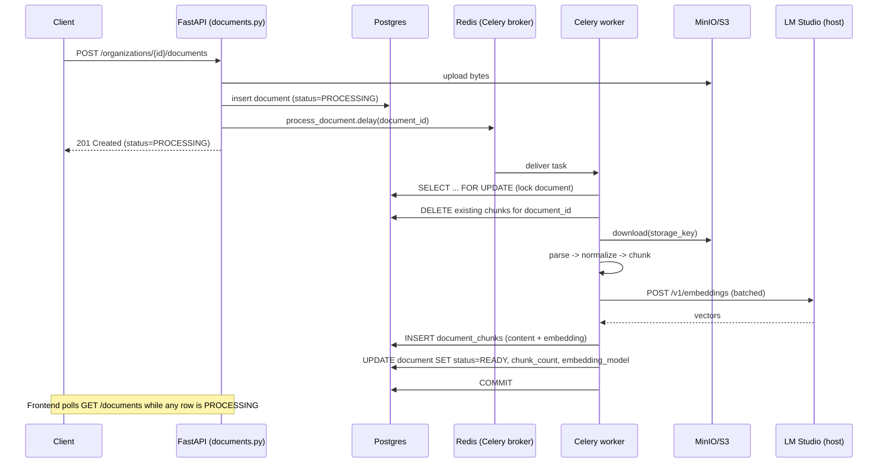
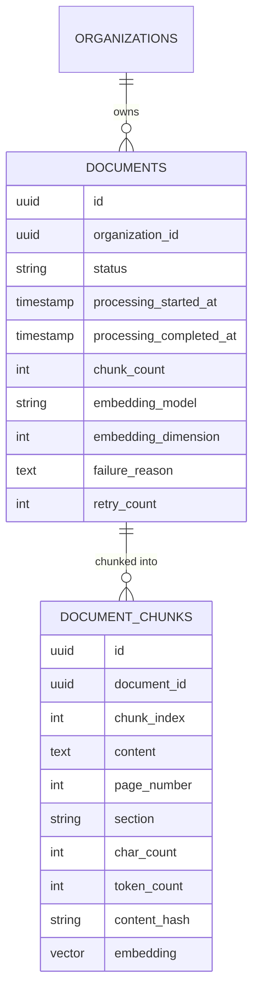
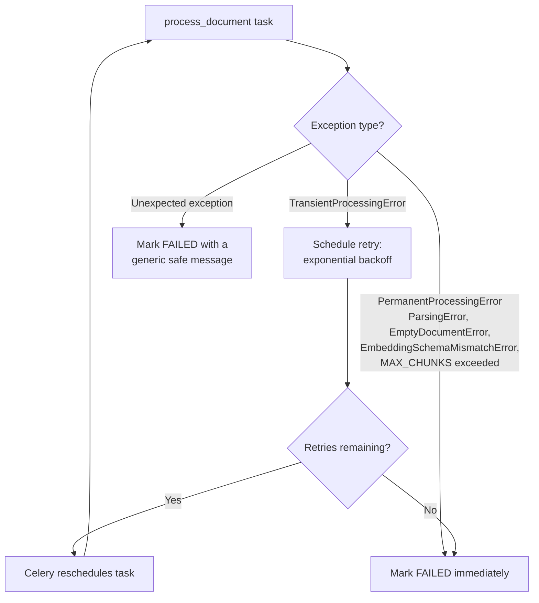

# Document Ingestion Pipeline (Phase 4)

How an uploaded document goes from `PROCESSING` to `READY`: parsing,
normalization, chunking, embedding, and storage in pgvector. This is the
first phase to run real background work (Celery) and the first to write
anything to `document_chunks`.

## Pipeline overview



On failure, the worker's own transaction rolls back (nothing partial is
committed) and a **separate** transaction records `FAILED` + a safe
`failure_reason` - see [Failure handling](#failure-handling-and-cleanup).

## Why Celery tasks can't use FastAPI's dependency injection

Storage (`StorageProvider`) and embeddings (`EmbeddingProvider`) are both
constructed via plain factory functions (`get_storage_provider()`,
`get_embedding_provider()`) rather than FastAPI `Depends()`. A Celery task
has no request/response cycle and no DI container - it's a synchronous
Python function that Celery calls directly - so the pipeline's core logic
(`app/ingestion/pipeline.py::process_document_pipeline`) takes storage,
embedding provider, and a session factory as **explicit parameters**. This
also makes it trivially testable: unit/integration tests pass in fakes
without any FastAPI machinery at all.

## Docker + Windows networking for LM Studio

FastAPI and Celery run inside Docker containers; LM Studio runs on the
Windows host. Inside a container, `localhost` refers to the container
itself, not the host machine - the same problem this project already solved
for a native Postgres install competing for port 5432 (see the main
README). The fix is `host.docker.internal`, which Docker Desktop resolves
to the host's IP from inside any container:

```
EMBEDDING_BASE_URL=http://host.docker.internal:1234/v1
LLM_BASE_URL=http://host.docker.internal:1234/v1
```

**To make LM Studio reachable from Docker:** in LM Studio's local server
settings, make sure it's *not* bound to `127.0.0.1` only - it needs to
listen on `0.0.0.0` (or at least accept connections from the Docker bridge
network) for `host.docker.internal` to reach it. Load an actual embedding
model (e.g. `nomic-embed-text`), not a chat model - see
[Embeddings](#embeddings) for why that distinction matters.

## Parsing

`app/ingestion/parsers/` defines a small `DocumentParser` protocol:

```python
class DocumentParser(Protocol):
    def parse(self, data: bytes) -> ParsedDocument: ...
```

`ParsedDocument` is a flat list of `ParsedElement(text, page_number,
section)`. An "element" is the smallest unit a parser can attach metadata
to:

| Format   | Element granularity        | Metadata captured                         |
|----------|-----------------------------|--------------------------------------------|
| PDF      | one element per page        | `page_number` (1-indexed)                  |
| DOCX     | one element per paragraph   | `section` = nearest preceding Heading-style paragraph |
| TXT      | whole file as one element   | none (no structure to preserve)            |
| Markdown | text between headings       | `section` = full heading path (`H1 > H2 > H3`) |

Parsing is intentionally synchronous (not `async def`) - Celery bridges into
asyncio once per task via `asyncio.run()`, and nothing else runs
concurrently on that loop, so a brief CPU-bound parse doesn't starve
anything the way it would inside a FastAPI request handler serving many
concurrent requests.

Markdown headings are parsed with a plain regex (`^#{1,6}\s+`) rather than a
full Markdown-to-AST library (mistune, markdown-it-py): ATX heading syntax
is simple and stable, and rendering the whole document to HTML just to
re-extract plain text would be more moving parts for the same result.

Parser failures raise `ParsingError` (a `PermanentProcessingError` - see
[Retry behavior](#retry-behavior)): a corrupt PDF or password-protected file
will never parse successfully no matter how many times it's retried.

## Text normalization

`app/ingestion/normalization.py::normalize_text` runs on every paragraph
before chunking. It is deliberately conservative - it exists to fix
extraction *artifacts*, not to rewrite content:

- Strips control characters (`\x00`-`\x1f` except `\t\n\r`) - Postgres
  rejects `\x00` in text columns outright, and no font encodes meaning in a
  control byte.
- NFKC Unicode normalization - folds compatibility characters (e.g. a
  non-breaking space) to their canonical form so text compares/embeds
  consistently regardless of source encoding quirks.
- Normalizes line endings to `\n`.
- Collapses 3+ blank lines to 2, and repeated spaces/tabs to one -
  extraction artifacts, not content.

It never lowercases, strips punctuation, or removes stopwords - any of that
would permanently discard information from the stored chunk. If needed at
all, that kind of normalization belongs at retrieval/query time (Phase 5),
not here.

## Chunking

`app/ingestion/chunking.py::chunk_document` is structure-aware, not naive
fixed-N-character splitting:

1. Each parsed element's text is normalized, then split into paragraphs
   (`\n\n`-separated).
2. A paragraph larger than the target chunk size is itself split - first on
   sentence boundaries (keeps sentences intact); if that produces no
   boundaries (one giant run-on sentence), on a fixed character window
   instead.
3. Paragraphs are packed greedily into chunks up to `CHUNK_SIZE_TOKENS`.
   A chunk's `page_number`/`section` come from its **first** paragraph.
4. Overlap is carried at paragraph granularity: after closing a chunk, the
   trailing paragraphs whose combined size fits within
   `CHUNK_OVERLAP_TOKENS` become the start of the next chunk. This avoids
   slicing the last N raw characters off a chunk, which can cut a sentence
   in half.

**Determinism**: `chunk_document` is a pure function of (parsed content,
`CHUNK_SIZE_TOKENS`, `CHUNK_OVERLAP_TOKENS`) - no randomness, no wall-clock
input - so re-running it on retry always reproduces identical chunks and
`content_hash` values.

**Token counting is an approximation** (~4 characters/token), not a real BPE
tokenizer like `tiktoken`. This is a deliberate trade-off: `tiktoken`
downloads its encoding tables over the network on first use, which would
give a project whose entire point is running at zero cost and fully offline
a hidden network dependency just to size chunks. `token_count` is stored per
chunk, so a more exact tokenizer can be swapped in later without a schema
change.

Each chunk stores: `chunk_index`, `content`, `page_number`, `section`,
`char_count`, `token_count`, `content_hash` (SHA-256 of `content`), and
`embedding`.

## Embeddings

`app/rag/embedding/base.py` defines the provider interface:

```python
class EmbeddingProvider(Protocol):
    dimensions: int
    model: str
    async def embed_documents(self, texts: list[str]) -> list[list[float]]: ...
    async def embed_query(self, text: str) -> list[float]: ...
```

`LMStudioEmbeddingProvider` (`app/rag/embedding/lmstudio.py`) implements
this against any OpenAI-compatible `/v1/embeddings` endpoint - LM Studio is
the zero-cost target, but the class works unmodified against any other
OpenAI-compatible server. It is configured entirely via environment
variables and never hardcodes a model name or dimension:

```
EMBEDDING_PROVIDER=openai_compatible
EMBEDDING_BASE_URL=http://host.docker.internal:1234/v1
EMBEDDING_API_KEY=not-needed-for-local
EMBEDDING_MODEL=nomic-embed-text
EMBEDDING_DIMENSIONS=768
EMBEDDING_BATCH_SIZE=32
EMBEDDING_REQUEST_TIMEOUT_SECONDS=30
```

A fresh `httpx.AsyncClient` is created per call rather than cached on the
instance - this provider runs both inside FastAPI (one event loop for the
process lifetime) and inside Celery tasks (a new event loop per task, via
`asyncio.run()`). Caching a client would bind its connection pool to
whichever loop first touched it, the same class of bug that once broke the
Redis-backed rate limiter in Phase 2.

**Dimension safety, two layers deep:**

1. Every batch response is checked: if a returned vector's length doesn't
   match `EMBEDDING_DIMENSIONS`, `EmbeddingDimensionMismatchError` is raised
   immediately - never silently truncated or padded. This catches "someone
   pointed `EMBEDDING_MODEL` at a chat model, or a model with a different
   output width, without updating `EMBEDDING_DIMENSIONS`."
2. Independently, `app/ingestion/schema_check.py` compares the *live*
   `document_chunks.embedding` column width (read via
   `format_type(atttypid, atttypmod)`, e.g. `vector(768)`) against
   `EMBEDDING_DIMENSIONS` - both at FastAPI startup (`app/main.py`'s
   lifespan) and at the start of every processing run. This catches the
   case the first check can't: `EMBEDDING_DIMENSIONS` and the model
   actually agree, but the *column* is still sized for a previous model.
   Both failures raise a message naming both numbers and what to do.

**Batching**: `embed_documents` sends `EMBEDDING_BATCH_SIZE` texts per HTTP
request, not one request per chunk. `MAX_CHUNKS_PER_DOCUMENT` (default
2000) bounds how much a single document can ever ask for in memory at once;
a document that would produce more chunks than that fails permanently
rather than silently truncating (truncating and marking the document
`READY` would mean part of it is unsearchable while the UI claims otherwise
- the same category of lie Phase 3 refused to tell with a fake `READY`
stub).

### Test-only provider

`app/rag/embedding/testing.py::DeterministicTestEmbeddingProvider` generates
deterministic vectors (same text -> same vector, correct configured width,
no network at all) for integration tests. It is **never** imported from
application code - only from tests. This keeps three test tiers genuinely
separate:

- **Unit tests** (`tests/unit/test_embedding_lmstudio.py`) mock the HTTP
  layer with `httpx.MockTransport` - no real network, tests the provider's
  own logic (batching, ordering, error mapping).
- **Integration tests** (`tests/integration/test_document_pipeline.py`,
  `test_document_processing_task.py`) run the real pipeline/task end to end
  against `DeterministicTestEmbeddingProvider` - proves the whole chain
  (parse -> chunk -> embed -> persist -> pgvector) actually works, without
  requiring LM Studio in CI.
- **E2E test** (`tests/e2e/test_lmstudio_e2e.py`) calls a real LM Studio
  instance and is skipped automatically if one isn't reachable - see that
  file for exactly what it checks and the Final Report for whether it
  actually ran in this environment.

## Database

`document_chunks` (migration `284636820202`):



- `document_chunks` has **no `organization_id` column**. Tenant isolation is
  inherited entirely through `document_id` - every chunk read goes through
  `DocumentChunkRepository`, which only ever takes a `document_id` a caller
  already fetched via `DocumentRepository.get_by_id_in_org` (the same
  membership-checked, 404-not-403 pattern every other org-scoped resource
  uses). There's deliberately no "get chunk by id alone" method, so there's
  no way to accidentally bypass the org check.
- `UniqueConstraint(document_id, chunk_index)` - the idempotency backstop:
  even if two workers somehow both process the same document concurrently
  (see [Concurrency](#concurrency-and-idempotency)), this constraint turns a
  silent duplicate into a loud `IntegrityError` instead.
- An `ivfflat` index on `embedding` with `vector_cosine_ops` supports
  approximate nearest-neighbor search for Phase 5's retrieval query.
- The `CREATE EXTENSION IF NOT EXISTS vector` statement is now part of this
  migration. Previously it was only ever run manually
  (`psql -c "CREATE EXTENSION ..."`) during local/CI setup - a real gap this
  phase closes, so `alembic upgrade head` alone provisions a fresh
  environment correctly.

**Migration downgrade note**: the extension is deliberately *not* dropped in
`downgrade()`. Unlike the Phase 2/3 native ENUM types (which this project's
migrations do drop explicitly, since Alembic autogenerate doesn't track
their lifecycle), dropping the `vector` extension would fail or cascade
depending on what else references it, and the test suite runs
`downgrade base` -> `upgrade head` every session - leaving the extension
installed makes that round-trip idempotent.

## Retry behavior

Every failure is classified as the pipeline runs:



- **Transient** (worth retrying): LM Studio temporarily unreachable, a 5xx
  from the embedding backend, a transient storage read failure. Backoff is
  exponential: `DOCUMENT_PROCESSING_RETRY_BACKOFF_SECONDS * 2^attempt`
  (default base 10s), capped at `DOCUMENT_PROCESSING_MAX_RETRIES` (default
  3) attempts.
- **Permanent** (never worth retrying): a corrupt/unparseable file, an empty
  document, a dimension mismatch, exceeding `MAX_CHUNKS_PER_DOCUMENT`, or a
  storage object that's genuinely missing (`404`/`NoSuchKey` - distinct from
  a transient storage error, since retrying a 404 changes nothing).
- Retries use `self.retry(exc=..., countdown=..., max_retries=...)` called
  manually (not `autoretry_for`), specifically so exhaustion can be caught
  and turned into a `FAILED` status write. Celery's `task_acks_late=True`
  (already configured since Phase 1) means a worker crash mid-task
  redelivers the message - safe here because reprocessing is idempotent
  (below).

## Failure handling and cleanup

If `process_document_pipeline` raises, its own database session is rolled
back when the `async with` block exits (SQLAlchemy's `AsyncSession.close()`
rolls back any open transaction) - so nothing from the failed attempt
survives, including the `status=PROCESSING` flip and any chunks it deleted
before failing further downstream. The `FAILED` status itself is then
recorded in a **separate** session/transaction, opened only after the
failure is already known - the same "commit the failure immediately, or
`get_db`'s rollback erases it" pattern Phase 2/3 established for auth-theft
detection and storage-upload failures.

`failure_reason` is always a safe, human-readable string chosen by the code
that raised the error (see `app/ingestion/errors.py`) - never a raw
exception message, stack trace, file path, or connection string fragment. A
last-resort `except Exception` at the top of the task guarantees this even
for a genuinely unexpected error: the document gets a generic "An
unexpected error occurred" message, and the real exception goes only to the
structured log (`exc_info=exc`), never to the document row a client can
read via the API.

If `.delay()` itself fails (e.g. the Redis broker is unreachable at upload
time), the document would otherwise sit in `PROCESSING` forever with no
worker ever assigned. `DocumentService._enqueue_processing` catches that and
flips the document straight to `FAILED` with a retryable reason instead.

## Concurrency and idempotency

Re-running the pipeline for the same `document_id` - a Celery retry, a
`task_acks_late` redelivery after a worker crash, or a user hitting the
retry endpoint - always starts by deleting that document's existing chunks
before re-inserting. This makes the pipeline safe to run twice: a partial or
duplicate run never leaves stray rows behind.

The document row is locked with `SELECT ... FOR UPDATE` for the duration of
processing. If two workers somehow both pick up the same `document_id`, the
second blocks until the first commits or rolls back, then sees the document
already `READY` and no-ops rather than deleting/re-inserting a second time.

## Security

- Uploaded files are never executed. Parsing uses `pypdf`/`python-docx`,
  which only read file structure - there's no code path that shells out to
  or interprets uploaded content as a program.
- The client-supplied filename is never trusted for anything beyond
  display - the storage key (and therefore what the parser reads) is
  derived entirely from the document's own UUID, exactly as established in
  Phase 3.
- The existing content-hash-based duplicate-upload rejection
  (`UniqueConstraint(organization_id, content_hash)`) is unchanged - this
  phase doesn't introduce a second, inconsistent duplicate-detection
  mechanism.
- A Celery task can only ever operate on the `document_id` it was given, and
  every DB query the pipeline issues is scoped to that document row - there
  is no code path by which processing one organization's document could
  read or write another's data.
- No internal exception text, file path, or secret is ever written to a
  field the API exposes (see [Failure handling](#failure-handling-and-cleanup)).

## API

`GET /organizations/{id}/documents/{document_id}` (unchanged route, extended
response) now returns processing metadata:

```json
{
  "status": "FAILED",
  "processing_started_at": "2026-09-12T09:04:48.087Z",
  "processing_completed_at": "2026-09-12T09:04:48.120Z",
  "chunk_count": 0,
  "embedding_model": null,
  "failure_reason": "Could not reach embedding backend at http://host.docker.internal:1234/v1. ...",
  "retry_count": 3
}
```

`POST /organizations/{id}/documents/{document_id}/retry` (new) re-queues a
`FAILED` document - MEMBER role or above, same as upload. Any other source
status is rejected (`409 INVALID_STATUS_TRANSITION`); this is not a general
"restart processing" button.

The upload endpoint's own behavior is unchanged in shape: it stores the file
and returns `PROCESSING` synchronously-but-fast, exactly as it did at the
end of Phase 3. It never parses, chunks, or embeds inline.

## Frontend

`/documents` polls `GET /documents` via TanStack Query's `refetchInterval`
whenever at least one row is `PROCESSING`, and stops polling once nothing is
(`refetchInterval` returning `false`). This is explicitly **not**
WebSockets, per the Phase 4 spec - that's a reasonable future upgrade, not
something this phase needed.

- `PROCESSING` shows a spinning indicator next to the badge - no fake
  progress percentage, since the pipeline doesn't report partial progress.
- `FAILED` shows the document's `failure_reason` inline and a retry button
  (role-gated the same as upload) that calls the new retry endpoint.
- `READY` behaves exactly as before (download/delete available).

## Known limitations

- `processing_started_at` is only ever persisted on a **successful** run -
  it's set inside the pipeline's own transaction, which rolls back on any
  failure along with everything else from that attempt. A document that
  ultimately fails will have `processing_started_at: null` even though
  processing was, in fact, attempted. `processing_completed_at` and
  `retry_count` are unaffected since they're written in the separate
  failure-handling transaction.
- Token counts are an approximation (~4 chars/token), not an exact
  tokenizer count - see [Chunking](#chunking) for why.
- No OCR: a scanned/image-only PDF with no embedded text layer parses to
  zero extractable text and fails as `EmptyDocumentError`, exactly like a
  genuinely empty file.
- `docs/architecture.md` and `docs/system-design.md` do not exist yet - this
  document plus the main README are the documentation that landed in this
  phase. Broader system-wide docs remain planned for a later phase, per the
  README's existing "lands in `docs/` starting Phase 12" note.

## What Phase 5 will need from here

Every chunk already carries what citation-backed retrieval needs: which
document it came from, its page number (PDF) or section path
(DOCX/Markdown), its exact text, and a vector comparable via pgvector's
cosine operator. Phase 5's job is querying that - `RETRIEVAL_TOP_K` /
`RETRIEVAL_CANDIDATE_POOL` / `MAX_CONTEXT_TOKENS` are already scaffolded in
config, unused until then.
