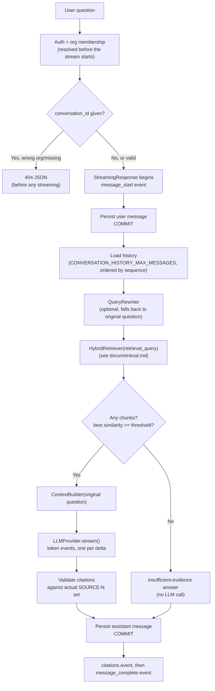

# Conversational RAG & Streaming (Phase 6)

Multi-turn conversational RAG: query rewriting for follow-up questions,
Server-Sent Events (SSE) streaming for the answer, and how both preserve
every guarantee Phase 5 already made (tenant isolation, citation
validation, prompt-injection delimiters, no DB connection held during slow
LLM calls). See `docs/rag.md` and `docs/retrieval.md` for the pipeline
this builds on - this document only covers what Phase 6 adds.

## Pipeline

Orchestrated by `RAGService.ask_stream()` (`app/services/rag_service.py`),
an async generator yielding plain domain events - it has no knowledge of
HTTP or SSE. `app/api/v1/chat.py`'s `chat_stream()` route is the only place
that turns those events into wire-format SSE frames
(`app/rag/streaming_events.py::format_sse`).

## Why a separate endpoint

`POST /organizations/{id}/chat/stream` exists alongside the unchanged
`POST /organizations/{id}/chat` rather than replacing it: the two return
genuinely different response shapes (one JSON body vs. an event stream),
and the non-streaming endpoint's existing clients/tests aren't touched by
anything in this phase.

## SSE event protocol

Every event is `event: <name>\ndata: <json>\n\n` (blank line terminates
the frame, per the SSE spec). `data` is always a flat JSON object - never
bare text - so the frontend has one parsing path per event type.

| Event | When | Payload |
|---|---|---|
| `message_start` | Immediately after the user's message is persisted, before retrieval | `{conversation_id, user_message_id}` |
| `token` | Once per incremental text delta from the LLM | `{text}` |
| `citations` | Once, after the full answer is generated and validated | `{citations: [...]}` (same shape as the non-streaming `/chat` response's `citations` field) |
| `message_complete` | Once, after `citations` | `{message_id, answer, chunks_considered, chunks_used}` |
| `error` | Any failure after `message_start` was already emitted | `{code, message}` |
| `retrying` | A transient provider failure (HTTP 429/503, a timeout, or a dropped connection) triggers an automatic retry - see RAGService's retry policy | `{attempt, max_attempts}` |

**A `retrying` event means the fresh attempt's `token` events are a new
generation, not a continuation.** Any tokens already accumulated from the
failed attempt must be discarded on receipt of `retrying` - the frontend
(`use-chat-stream.tsx`) resets its buffer here, otherwise the next
attempt's tokens would silently concatenate onto the discarded ones. The
backend enforces the same rule server-side (RAGService resets its own
`deltas` per attempt), so the eventual `message_complete.answer` only ever
reflects whichever attempt actually succeeded.

**`token` events carry unvalidated model output.** A `[SOURCE-N]` tag can
arrive split across multiple `token` events, and may reference a source
number the citation validator later strips as fabricated. `answer` on
`message_complete` is the single authoritative, validated final text -
frontend clients must **replace** their accumulated token buffer with it,
not treat streamed tokens as final. This is also how the zero-valid-
citations case surfaces: the client sees streamed tokens, then
`message_complete.answer` is the fixed insufficient-evidence string
instead, because `validate_citations()` demoted it after generation - see
`docs/rag.md`'s "insufficient evidence" behavior, unchanged from Phase 5,
just applied to the accumulated stream text instead of a single
`generate()` return value.

### Error codes

| Code | Meaning | Where it can occur |
|---|---|---|
| `EMBEDDING_UNAVAILABLE` | Embedding backend unreachable during query rewriting or retrieval | Retrieval step |
| `RETRIEVAL_FAILED` | A non-embedding failure during retrieval (e.g. the database) | Retrieval step |
| `LLM_TIMEOUT` | The LLM backend didn't respond within `LLM_REQUEST_TIMEOUT_SECONDS`, before any output | Generation step, before first token |
| `LLM_UNAVAILABLE` | The LLM backend refused the connection or returned an HTTP error before any output | Generation step, before first token |
| `LLM_STREAM_INTERRUPTED` | The connection broke, timed out, or sent a malformed chunk **after** at least one token was already yielded | Generation step, mid-stream |
| `CONVERSATION_NOT_FOUND` | `conversation_id` doesn't exist or belongs to another org | Resolved before the stream starts - a real 404 JSON, not an SSE event |
| `STREAMING_DISABLED` | `STREAMING_ENABLED=false` | Resolved before the stream starts - a real 503 JSON |
| `INTERNAL_ERROR` | Anything that reached the route's generator without being turned into one of the above inside `ask_stream()` - a bug, not an expected failure mode | Anywhere |

`LLM_UNAVAILABLE` and `LLM_TIMEOUT` are deliberately different codes ("the
backend is broken" vs. "the backend is just slow right now") - see
`LLMProviderTimeoutError`'s docstring in `app/rag/llm/base.py`.
`LLM_UNAVAILABLE`/`LLM_TIMEOUT` and `LLM_STREAM_INTERRUPTED` are likewise
deliberately different: a failure before any token was produced can be
retried from scratch with no partial state; a failure mid-stream means the
client already rendered partial text that must be discarded (nothing is
persisted for a mid-stream failure either - see "Persistence" below).

`RETRIEVAL_FAILED` versus the insufficient-evidence answer: these are
different system states that must never be conflated. Insufficient
evidence is a normal, successful outcome ("retrieval worked, found
nothing relevant enough"); `RETRIEVAL_FAILED` is retrieval not completing
at all.

Auth/RBAC failures (`UNAUTHORIZED`/`FORBIDDEN`/organization-not-found) are
all resolved by `get_org_context`/`require_role` **before** the response
is constructed, exactly like every other route in this codebase - they
are normal JSON error responses, never SSE events, because the stream
hasn't started yet at that point.

## Query rewriting

`app/rag/query_rewrite/`: a `QueryRewriter` Protocol (`base.py`),
`LMStudioQueryRewriter` (`lmstudio.py`) - built on top of the existing
`LLMProvider` rather than a second HTTP client, since rewriting is just
another chat completion - and a test double (`testing.py`), same shape as
the `EmbeddingProvider`/`LLMProvider` abstractions.

`original_query` (what the LLM answers) and `retrieval_query` (what
`HybridRetriever` searches with) are kept strictly separate end to end -
`RAGService.ask_stream()` passes `retrieval_query` to `self.retriever.retrieve()`
and the unmodified `question` to `build_messages()`. See
`test_retrieval_uses_rewritten_query_but_llm_receives_original_question`
in `tests/integration/test_rag_service_streaming.py` for the test that
verifies both halves of this at once.

**Rewriting is an optimization, never a source of truth.** Every failure
mode falls back to `retrieval_query = original_query`, is logged with a
`fallback_reason`, and never breaks the chat turn:

| `fallback_reason` | Cause |
|---|---|
| `disabled` | `QUERY_REWRITE_ENABLED=false` |
| `no_history` | First turn of a conversation - nothing to resolve, and skips the LLM round-trip entirely |
| `timeout` | No response within `QUERY_REWRITE_TIMEOUT_SECONDS` (deliberately much shorter than `LLM_REQUEST_TIMEOUT_SECONDS` - a slow rewrite should degrade almost immediately, not consume the same 120s budget the real answer generation gets) |
| `llm_error` | The LLM backend was unavailable or returned a malformed response |
| `empty_output` | The model returned nothing (after stripping whitespace/quotes) |
| `implausible_length` | The output is more than 4x the length of the original question - a local model answered instead of rewriting |

The rewrite prompt (`QUERY_REWRITE_SYSTEM_PROMPT` in
`app/rag/prompts/templates.py`) explicitly instructs the model: use history
only to resolve references, don't answer the question, output only the
standalone query, and treat the conversation history as untrusted content
rather than instructions (see "Prompt injection" below).

## Conversation history

Reuses `MessageRepository.list_recent_before()` from Phase 5, bounded by
`CONVERSATION_HISTORY_MAX_MESSAGES` and ordered by `Message.sequence` - a
Postgres `IDENTITY` column, not `created_at` (see `docs/system-design.md`'s
"Message ordering" section for the transaction-timestamp-tie bug that
`sequence` fixes). Phase 6 does not add unlimited history, long-term
semantic memory, or vectorized conversation memory - out of scope, per the
Phase 6 spec's explicit boundaries.

## Streaming LM Studio provider

`LLMProvider.stream()` (added alongside the existing `generate()`, not a
second provider implementation) uses LM Studio's OpenAI-compatible
streaming chat completions API (`"stream": true`), parsing `data: {...}`
lines from the response with `httpx`'s `aiter_lines()` and stopping on
`data: [DONE]`. Never buffers the full response before yielding - each
parsed delta is yielded as soon as it arrives, which is what makes
time-to-first-token (`llm_time_to_first_token_ms`) a meaningful metric.

A malformed chunk, or a connection break/timeout after at least one delta
was already yielded, raises `LLMProviderStreamInterruptedError` rather
than `LLMProviderUnavailableError` - see the error-code table above.

## Persistence: no DB connection held during generation

Same principle as Phase 5's `ask()` (see `docs/system-design.md`), applied
twice in `ask_stream()`: the DB transaction is rolled back (never
committed - nothing was written) immediately before *both* slow external
calls - the query-rewrite LLM call and the answer-generation stream -
releasing the pooled connection for their full duration rather than
holding it idle. `rollback()` expires every ORM object still attached to
the session, which is why `ask_stream()` captures the conversation id as a
plain value before the first rollback rather than re-reading it off the
ORM object afterward.

**If generation fails (any `error` event), no assistant message is
persisted at all** - not a partial one, not one containing whatever text
had streamed so far. The user's question is already durable (committed
before generation started), so the conversation shows their question with
no reply, exactly like a failed `ask()` call in Phase 5 - the client sees
the real error code and can retry.

### Why the streaming route can't use `Depends(get_db)`

A yield-dependency like `get_db()` is torn down as soon as the route
handler function *returns* - which, for a `StreamingResponse`, happens as
soon as the response object is constructed, before Starlette has iterated
the generator body even once. The generator's actual DB work happens later,
while the response streams. Using `get_db`'s session there would mean
writing to an already-closed session. `chat_stream()` instead resolves
auth/conversation-ownership with the normal per-request `db` session (torn
down when the route function returns, which is fine - that work is
already done by then), and the generator opens its own session via
`get_session_factory()` (`app/core/database.py`), independent of the
request/response dependency lifecycle. Tests override this dependency
(see `tests/conftest.py`'s `client` fixture) so streaming route tests still
run inside the test's rolled-back transaction instead of writing to the
real test database.

## Citations

Unchanged validation logic from Phase 5 (`app/rag/citations.py`), applied
to the fully accumulated streamed text rather than a single `generate()`
return value: the retrieved source set is the sole source of truth, a
`[SOURCE-N]` tag the model invents is stripped from the visible answer and
never appears in the structured `citations` list, and zero valid citations
after generation is treated as insufficient evidence - same fixed answer,
same reasoning, as Phase 5. Streaming never bypasses this: `citations` and
`message_complete` are only emitted after validation completes.

## Prompt injection

Phase 5's defenses (`SYSTEM_PROMPT`'s 9 rules, the
`-----BEGIN/END CONTEXT-----` delimiters around retrieved documents) are
unchanged. Phase 6 adds the same treatment to two more untrusted-content
surfaces: conversation history (rule 6 of `QUERY_REWRITE_SYSTEM_PROMPT`
explicitly tells the rewriter to treat prior chat content as data, not
instructions) and the query-rewrite step itself, which never overwrites
the actual question answered by the LLM (see "Query rewriting" above -
even if a rewrite were somehow manipulated, it can only misdirect
retrieval, never became the question the model is told to answer).

As in Phase 5: this is verified at the prompt-**construction** level
(mechanically testable - malicious content provably stays inside the
untrusted-context delimiters and is never treated as the actual question)
not at the model-**response** level, which cannot be verified without a
real LLM in the loop. See `tests/unit/test_prompts.py` and the
prompt-injection tests in `tests/integration/` for what's actually
covered.

## Client disconnect & cancellation

When a client disconnects mid-stream, Starlette closes the response's
async generator (`ask_stream()`) via `aclose()`. `ask_stream()` wraps its
`async for delta in self.llm.stream(messages)` loop in
`contextlib.aclosing()` specifically so that teardown propagates into the
LLM provider's own stream generator too, rather than leaking it to
non-deterministic garbage collection - this closes `LMStudioLLMProvider`'s
`httpx` streaming connection to LM Studio as part of the same teardown.

**What this does and does not prove:** our connection to LM Studio is
verifiably closed on disconnect (see
`test_cancelling_the_generator_mid_stream_does_not_persist_assistant_message`
in `tests/integration/test_rag_service_streaming.py`, using a test double
that records whether it observed cancellation). Whether LM Studio itself
halts the underlying generation work when its client connection drops is
**not verified** - that depends on LM Studio's own server behavior, which
this project doesn't control or test against. No claim of true upstream
cancellation is made.

No assistant message is persisted for a cancelled turn, for the same
reason as any other generation failure (see "Persistence" above).

## Regenerate

`POST /organizations/{id}/conversations/{id}/regenerate` (also SSE, same
event protocol) reruns the pipeline for the conversation's most recent
user message and appends a **new** assistant message - it never duplicates
the question or deletes the previous answer. `Message.sequence` keeps the
three-message run (question, old answer, new answer) in honest order;
showing only the latest reply (if a client wants that) is a rendering
choice, not a data-model one. `RAGService.regenerate_stream()` shares its
entire rewrite/retrieve/generate/validate/persist tail
(`_answer_stream()`) with `ask_stream()` - the only difference is where the
question and preceding history come from (an existing message vs. a newly
persisted one). Returns `404 NO_MESSAGE_TO_REGENERATE` if the conversation
has no user message yet, and the same pre-stream 404 as `/chat/stream` for
a cross-tenant or nonexistent conversation id.

## Configuration

| Setting | Default | Meaning |
|---|---|---|
| `QUERY_REWRITE_ENABLED` | `true` | Master switch for the query-rewrite step |
| `QUERY_REWRITE_TIMEOUT_SECONDS` | `10.0` | Falls back to the original question past this |
| `QUERY_REWRITE_MAX_TOKENS` | `100` | Caps the rewrite LLM call's response length |
| `STREAMING_ENABLED` | `true` | Gates `/chat/stream`; `false` returns `503 STREAMING_DISABLED` before any DB/LLM work |
| `CONVERSATION_HISTORY_MAX_MESSAGES` | `6` | Unchanged from Phase 5 |

## Known limitations

- `LLM_TIMEOUT` distinguishes "the backend never responded" from
  `LLM_UNAVAILABLE`, but there's no separate, more granular timeout
  taxonomy (e.g. distinguishing a connect timeout from a read timeout) -
  not needed at this project's scale.
- True upstream cancellation at LM Studio is unverified (see "Client
  disconnect & cancellation" above) - only this project's own connection
  teardown is.
- Query rewriting is judged only by wiring/fallback-behavior tests and a
  small evaluation dataset (`app/evaluation/`), not by a labeled set of
  real conversational rewrites - the same "no calibrated ground truth yet"
  limitation `docs/retrieval.md` already documents for the retrieval
  confidence threshold.
