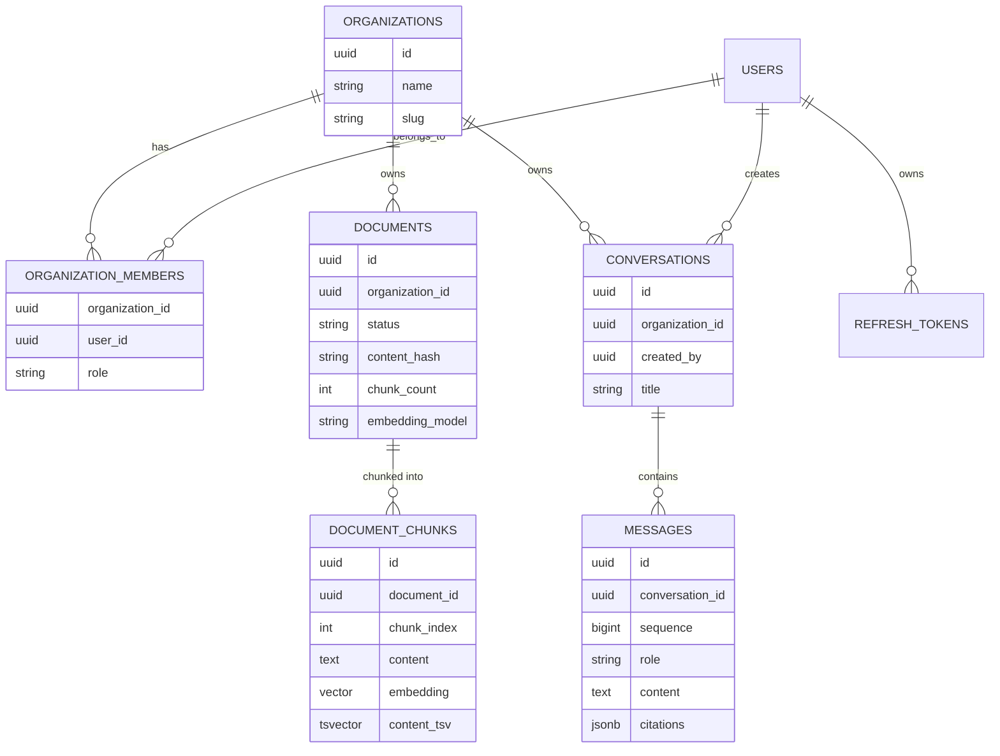
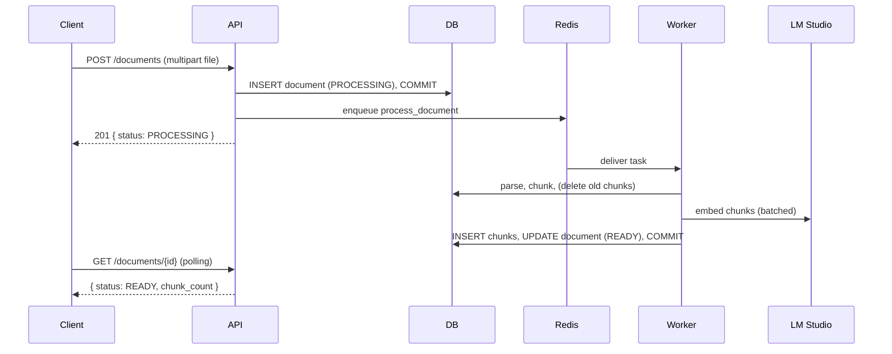
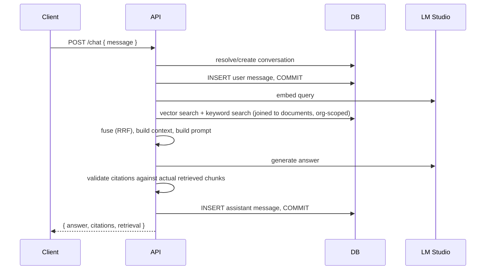

# System Design

Data model, request lifecycles, and the concrete design decisions behind
them, as of Phase 5. Complements `docs/architecture.md` (component-level
view) with the entity/schema/flow-level view.

## Entity-relationship overview

Two tables are intentionally missing an `organization_id` column of their
own: `document_chunks` (reached through `documents`) and `messages`
(reached through `conversations`). This isn't an oversight - duplicating
the tenant key onto every child table creates a second source of truth that
can drift from the parent (what happens if a document is ever transferred
between orgs?), and every read path already has to join to the parent
anyway to get metadata it needs (document name for citations, conversation
ownership for auth). See `docs/retrieval.md` and `docs/rag.md` for the
specific join patterns.

## Authentication & session design

Access token (JWT, 15 min) + refresh token (opaque random string, 30 days,
rotated on every use) as separate HTTP-only, `SameSite=Lax` cookies. Full
design (theft detection, rotation) is in the README's "Authentication &
authorization design" section - unchanged since Phase 2, not repeated here.

## Request lifecycle: document upload → ready

Full detail (retry/idempotency/failure handling) in
`docs/document-ingestion.md`.

## Request lifecycle: chat question → answer

Full detail (retrieval math, prompt design, citation validation) in
`docs/rag.md` and `docs/retrieval.md`.

## Why two separate commits per chat turn

The user's message is committed **before** retrieval/generation begins, and
the assistant's message is committed **after** - not one transaction
wrapping the whole turn. A local LLM generation can take 30-120s; holding a
Postgres connection (and the row locks/MVCC snapshot that implies) open for
that whole span would exhaust `DB_POOL_SIZE` (10 by default) after a
handful of concurrent chats. This mirrors the same "commit early, don't
hold a transaction across slow I/O" principle Phase 3/4 established for
storage failures and document processing.

Retrieval (embedding the query, then vector + keyword search) runs in
between those two commits and reads through the same session, which
auto-begins a new transaction for those queries. That transaction is
**rolled back** (not left open) immediately before the LLM call, for the
same reason: nothing has been written yet, so there's nothing to commit,
and rollback releases the pooled connection just as surely as commit would.
Without this, the connection acquired for the retrieval queries would sit
idle-in-transaction for the entire LLM generation - `retrieval_latency_ms`
is typically tens of milliseconds, `llm_latency_ms` tens of seconds, so
this is the difference between a connection held for milliseconds vs. one
held for the bulk of the request. One consequence worth naming: `rollback()`
expires every ORM object still attached to the session, so `RAGService`
captures the values it needs (like the conversation id) as plain Python
values *before* the rollback rather than re-reading them off an ORM object
afterward.

One consequence, made explicit rather than hidden: if the LLM call fails
(LM Studio down, timeout), the user's question is still persisted - the
conversation shows their message with no reply, not silently dropped. The
client sees the actual error (`LLM_UNAVAILABLE`) and can retry by resending
the same question.

## Message ordering: `sequence`, not `created_at`

`messages.sequence` is a Postgres `IDENTITY` column and the sole ordering
key for conversation history - not `created_at`. Postgres's `now()`/
`CURRENT_TIMESTAMP` is fixed for the entire lifetime of a transaction (not
re-evaluated per statement), so two messages committed in the same
transaction can receive an identical timestamp. This was caught in
practice: this test suite's SAVEPOINT-nested test-isolation strategy (see
`tests/conftest.py`) keeps one outer transaction open for an entire test,
which made a real `created_at`-based history query silently return nothing
during test development. Rather than treat that as a test-only quirk, it
was fixed at the schema level with a proper monotonic identity column -
production code under real load could plausibly hit the same ambiguity
(sub-millisecond back-to-back commits), just less predictably.

## Configuration

All environment variables are read in exactly one place
(`app/core/config.py`, a `pydantic-settings` `Settings` class) - never
scattered `os.getenv()` calls. Defaults favor zero-cost local development
(LM Studio endpoints, MinIO, a bundled Postgres/Redis). Every tunable
introduced by the RAG pipeline (retrieval weights, thresholds, context
limits, timeouts) is a named setting, not a hardcoded constant - see
`docs/retrieval.md` and `docs/rag.md` for what each one controls.

## Testing strategy

Three tiers, applied consistently since Phase 4 and extended in Phase 5:

1. **Unit** - pure functions/classes with no DB or network (fusion,
   context building, citation validation, prompt construction, parsers,
   chunking). Fast, exhaustive.
2. **Integration** - real Postgres (via a per-test transaction + SAVEPOINT,
   rolled back after), real pgvector/FTS queries, but a deterministic fake
   for anything that would otherwise require a live LM Studio
   (`DeterministicTestEmbeddingProvider`, `StubLLMProvider`).
3. **E2E** - the real LM Studio, skipped automatically (not faked) when
   unreachable. See each phase's Final Report for whether this tier
   actually ran in a given environment - a skip is reported honestly, never
   presented as a pass.

See `docs/rag.md`'s "Testing" section for what specifically each tier can
and cannot prove about the RAG pipeline (particularly: a deterministic
hash-based test embedding proves wiring, never semantic retrieval quality).
